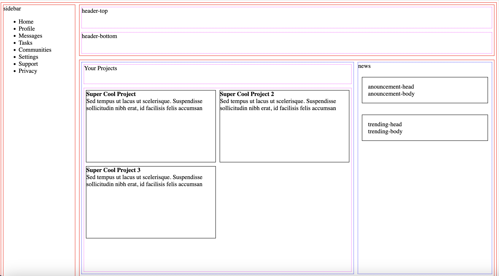

# odin-admin-console

# 1) I asked ChatGPT: Start by writing out the HTML elements for the sidebar, header and main-content containers. In your CSS file, apply Grid properties until you have this basic layout built.

It gave me the basic layut:
```html
<div class="container">
  <div class="sidebar">
    <!-- sidebar content goes here -->
  </div>
  <div class="header">
    <!-- header content goes here -->
  </div>
  <div class="main-content">
    <!-- main content goes here -->
  </div>
</div>
```
and css:
```css
.container {
  display: grid;
  grid-template-columns: 200px 1fr; /* 200px sidebar, 1fr main content */
  grid-template-rows: 50px 1fr; /* 50px header, 1fr main content */
  grid-template-areas: 
    "sidebar header"
    "sidebar main-content";
}

.sidebar {
  grid-area: sidebar;
}

.header {
  grid-area: header;
}

.main-content {
  grid-area: main-content;
}
```
Nice job, we will continue alone, 'cause it is not fair ;-)

# 2) Nesting from there, I built the rest as nice little layout:


It looks easier, just follow the process! Decided to end it here, because the rest is not important for me right now ;-)